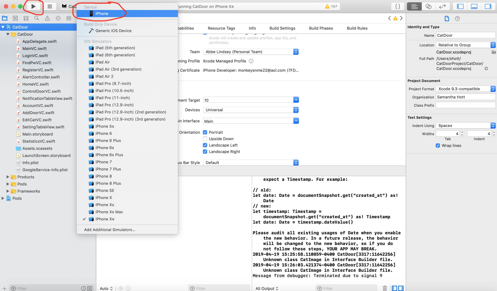
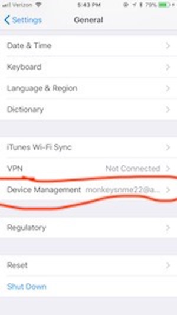

# Cat Door Extraordinaire

This project aims to control the lock on a cat door through an app so that the user can control the door away from home without the need to use special collars or put a chip inside their cat. We also use computer vision to detect cats and intruders so that intruders, such as a racoon, are not allowed entry.

## Release Notes
We were able to include the following features:

- Detecting an intruder and disallowing access
- Ability to control the door with the app
- Having a physical door that moves to appropriate lock positions and has a camera for computer vision
- Ability to edit account information

Below are features we were not able to include:

- Ability to create a schedule to change the state of the door
- Statistics, such as how many times a cat used the door
- Having the door unthethered from a computer
- Detection of prey in cats mouth

## Prerequisites

- Mac Computer
- Most recent version of XCode from the Apple App Store
- Apple ID

### Installing the App

- Make sure that you are on the master branch of this repository


- Then, you want to press the green clone of download button and choose to open the project in Xcode


- Next, the project should open up in Xcode

- After this, you want to to select the Xcode tab in the upper left (next to the apple symbol) and then select preferences


- Make sure you are on the accounts tab and then press the plus(+) button in the bottom left


- Make sure that Apple ID is selected and then press continue

- Now, login with your Apple ID credentials

- You should now see your Apple ID account listed

- You can then close out of this pop-up screen

- Next, you want to make sure you have the file named CatDoor with a blue symbol selected in the folder view and you also need to make sure that on the main screen, you are looking at the general tab


- You then want to scroll down to the section named Signing and select the drop down menu where it says team and select Personal Team (you will continue to see an error message even after this step)


- You next should scroll up to the section named Identity and delete what is written in the text field for Bundle Identifier and replace it with your Apple ID username


- Next, you should scroll down again to the section named Deployment Info and make sure that the text field labelled Deployment Target is set to a number that is less than or equal to the current software version you are running on your iphone. In this case, the phone I was using had a version of software greater than version 10


- After this, you should connect your iPhone to your computer

- You then need to click on the tab located near the play button at the top of the application that will be labelled with the name of some type of iPhone. This tab will be directly next to another tab that says CatDoor


- You should select the option on the top that says iPhone and then click the play button(triangle)


- You can now wait for the app to install onto your phone. Once this is done, you can open up the app. However, you will receive an error message like the following:


- Cancel out of this message and then open up the setttings app on your phone. Then, navigate to the general tab. You can then scroll down until you see an option called Device Managment- click on it.



- You will then see an option with your Apple ID- click on this

- Then select trust and confirm it in the popup window

- After this, you can open the Catronics App again and your app installation will be complete


### Installing the Computer Vision Program

Go to a following link: https://drive.google.com/drive/folders/19lhar-c-ds-KsbpLxQeAkCLErA2ILdnl?usp=sharing

- You can see following two files, one is a ActiveTcl dmg file for installing libraries for our program, and the other is our vision program zip file.


- Once you download a dmg file, click and install pkg (just click oks).


- Unzip our vision program and just run it!


### Installing the Hardware

A step by step series of examples that tell you how to get a development env running

To connect arduino:

```
1). connect the yellow wire from servo to pin 9
2). connect the red wire from servo to 5v
3). connect the black wire from servo to GND
4). connect the arduino to the computer via USB


```

To install the cat door:

```
Cat Flap Installation Instructions

 

TOOLS REQUIRED

Straight edge/ruler
Drill
½” drill bits
Keyhole/scroll saw
Phillips screwdriver
Letters inside the ( ) correlate to the images above.

 

INSTRUCTIONS

Step 1: Determine the pet door height. The distance between the bottom of the door and bottom of template should be 6”. Center the template (width) in the middle of the door and tape in place.

Step 2: With the template in place (A), draw around the edge of the template onto the door. Mark the corner holes with a nail or awl.

Step 3: Using the corner locations as your guide, drill four individual holes with a drill no longer than ½”.

Step 4: Starting on the inside of one of the drilled holes (B), cut just inside of the line using a keyhole or scroll saw.

Step 5: Insert the inner frame that contains the flap (C) into the opening from the interior side. Make sure that the frame is flush with the door surface. Caulking is recommended under the outer frame. Place the outer frame that does not contain the flap (D) into the opening from outside the door. Hold it in place and install the screws. Do not overtighten.

 

For Doors with Uneven Surfaces
After cutting the rough opening, build up the lowest areas with a wood frame thick enough to create an even door surface. Then proceed with the steps above.

For Walls:

Once the wall opening has been made, it is necessary to build a frame to cover the exposed area between the wall surfaces. When cutting through walls, use extreme caution and make sure not to cut any concealed wires, gas lines, or water pipes.

For Steel Doors:

Use a jigsaw with a hacksaw blade to cut the opening, starting at the pre-drilled corner holes. Then proceed with the steps above.
```

Our vision program requires our embedded camera to capture a face of a cat well. So adjust the height of placement of our catdoor. Also, if you think arduino needs to be more secure, try to cover the device.


## Troubleshooting

If you cannot open our vision program, you might want to change a Tcl framework path. Try to move your Tcl framework to
following folder. /Library/Frameworks/Tcl.framework


